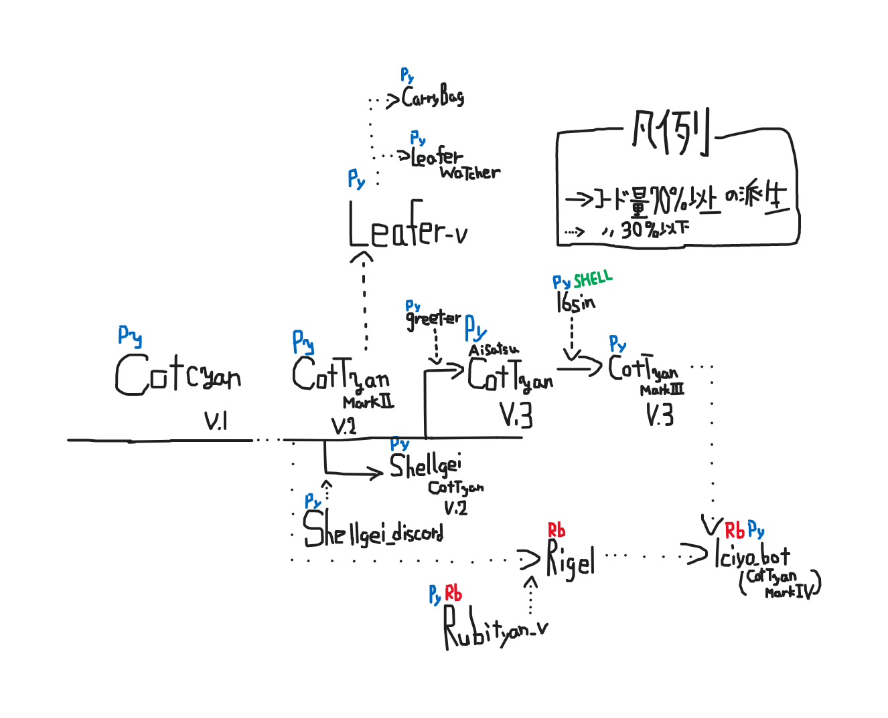

# MyBots
### わたしのBot一覧

## No.1 CotTyan

https://github.com/laminne/cottyan  (二代目)
自分が一番最初に実装したBot

#### 系譜:

## No.2 CotTyan Mark II

https://github.com/kosen20s/CotTyan  
初代CotTyanに搭載されていた権限付与機能をきれいに書き直したもの  
GPG鍵の取得やシェル芸外部実行機能も実装済み  

## No.3 CotTyan Mark II V.3.x

https://github.com/cottyan-mark2  
MarkIIの機能に権限未保持者に対する定期メンション機能を搭載したもの  

## No.4 Leafer(Prograss)

https://github.com/kosen20s/leafer  
CotTyan MarkIIのコードを一部使用した草BotのPython実装(使用は非推奨)  
大きな脆弱性が複数存在したため現在は使われていない  
派生にLeafer-nodeが存在(製作者はわたしじゃない)

## No.5 Watcher  

Leaferのコードを変えて鯖内のメッセージを取得するようにしたもの(実験運用)  

## No.6 CotTyan Mark III  

MarkIIにあったいくつかの問題を解決して外部コマンド実行に対応したもの  

## No.7 RubiTyan-V  

MarkIIの完全互換かつフルスクラッチRuby実装を目指して作られたBot  
とある事情でPython実装になった  

## No.8 Rigel

MarkIIの機能のすべてをRubyで完全に書き直したもの  
数少ないDiscordrbを使ったBot  

## No.9  IchiyoBot  

限界LT鯖で使用されたBot  
質問転送機能などを実装した
RigelとMarkIIのコードを半分ずつ使ったもの

## No.10 CotTyan Mark IV  

{WIP}DiscordBotのBusyBoxを目標にした複合Bot(要は練習機)  
